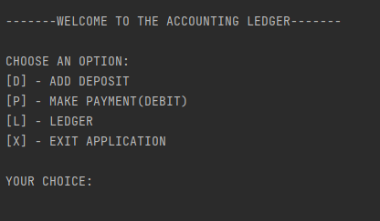
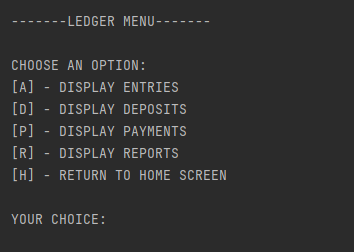
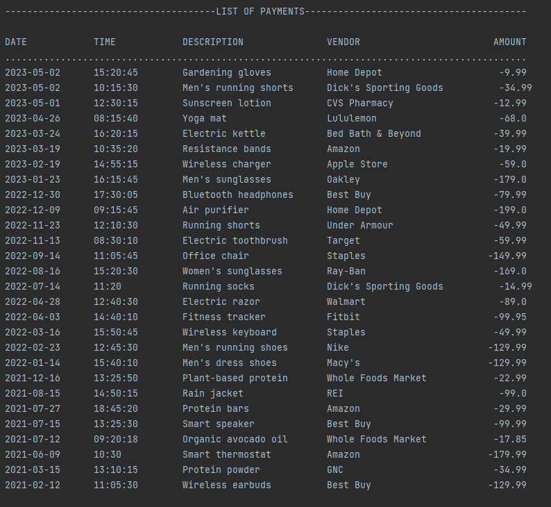
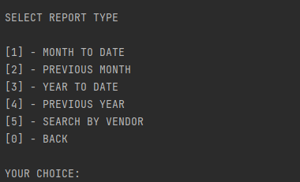
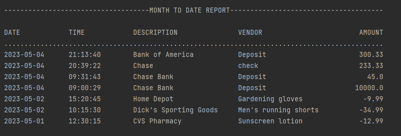
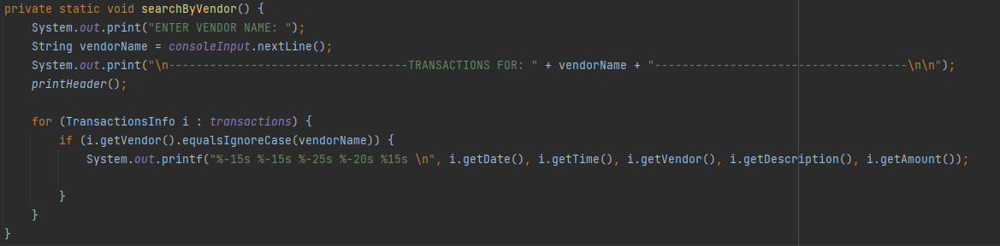

# Accounting Ledger 
***Accounting Ledger Application***  allows user  to input and view accounting transactions.
Also, user will be able to create reports based on different date ranges.

## Features:

* Able to add deposits
* Able to make payments
* Able to view ledger transactions
* Able to create reports based on ranges
    - Month To Date
    - Year To Date
    - Previous Month
    - Previous Year
    - Search by Vendor Name

## Application Screen Images
### Home Screen:

### Ledger Screen:

### List of Transactions:

### Reports Screen:

### Example of Report:

### Interesting Piece of Code:
